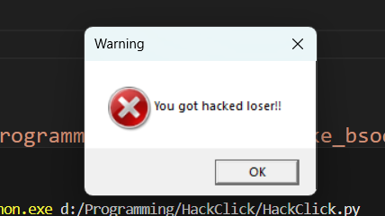

#  ClickTroll - Scary Mouse Prank

A Python prank tool that reacts to mouse clicks in unexpected ways:

-  Right-click triggers a fake "You've been hacked!" message.
-  Left-click simulates a fake Blue Screen of Death (BSOD).

##  Disclaimer

This project is for educational and entertainment purposes only. Do not use it to harm, annoy, or prank people without their consent. I take no responsibility for how you use it.

---

##  Features

✅ Detects left and right mouse clicks  
✅ On right-click: runs a VBScript to display a scary message  
✅ On left-click: opens a fullscreen fake BSOD image  
✅ Totally offline, no internet or admin rights required  
✅ No external hardware needed

---

## Screenshots

> Here's what the output looks like:

  
_Fake "You've been hacked!" message_

  
_Simulated Blue Screen of Death_

---

##  Requirements

- Python 3.x
- Modules: `pynput`, `os`, `ctypes`, `subprocess`, `time`

Install dependencies (if needed):

```bash
pip install pynput
